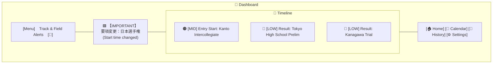
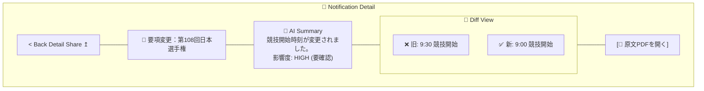

# モバイルワイヤーフレーム / 画面設計 (Wireframes)

"Sports Stylish" デザインコンセプトに基づく画面構成案。
**カラーパレット**:
- **Background**: Dark Navy (`#0A192F`) - プロフェッショナル、没入感
- **Accent**: Track Orange (`#FF5722`) - 警告、アクション、情熱
- **Text**: White (`#FFFFFF`) & Light Gray (`#E0E0E0`) - 視認性
- **Sub**: Cyan/Teal (`#00BCD4`) - 情報、正解、リンク

## 1. Onboarding (プロファイル設定)
- **目的**: ユーザーの関心事項を絞り込み、通知のRelevanceを高める。
- **UI構成**:
    - **Header**: 「あなたの競技ライフに合わせてカスタマイズ」
    - **Selection**:
        - 所属エリア (例: 東京, 神奈川) のチップ選択
        - 専門種目 (例: 短距離, 跳躍) のアイコン付きグリッド選択
        - トラック利用 (例: 中学, 高校, 一般)
    - **CTA**: 「モニタリングを開始 (Start)」ボタン（画面下部固定、オレンジ色の大きなボタンで浮遊感）

## 2. Dashboard (今日の重要更新)
- **目的**: 最新の重要情報を一目で把握する。
- **UI構成**:
    - **Top Bar**: アプリロゴ + インジケータ
    - **Hero Section**: 「今日のHigh Alert」があればカード形式で大きく表示（赤/オレンジの枠線）。
    - **Timeline**: 時系列の更新リスト。各カードには「県名バッジ」「種目タグ」「日付」を表示。
    - **Bottom Nav**: Dashboard / Calendar / History / Settings

## 3. 通知詳細 (Notification Detail)
- **目的**: 更新内容とその意味を理解し、原文を確認する。
- **UI構成**:
    - **Title**: 大きな見出しで「要項変更：〇〇大会」
    - **Impact Box**: 「⚠️ 競技開始時間が30分早まりました」と要約を表示（背景色付き）。
    - **Diff View**:
        - Before:「9:30 競技開始」
        - After:「9:00 競技開始（変更）」(赤字強調)
    - **Action**: 「原文PDFを開く」ボタン（アイコン付き）。
    - **Share**: フローティングアクションボタン(FAB)でシェア。

## 4. Calendar (大会/期限)
- **目的**: 近い締め切りや大会日を把握する。
- **UI構成**:
    - **Month View**: 月表示。大会がある日にドット。
    - **Event List**: 選択した日のイベントリスト。
    - **Countdown**: 「エントリー締切まであと3日」等のカウントダウンバーを各イベントに併記。

## 5. 履歴 (History/Archive)
- **目的**: 過去の情報を検索・確認する。
- **UI構成**:
    - **Filter**: 期間、団体、重要度でフィルタリング。
    - **List**: シンプルなリスト表示。既読/未読をスタイルで区別。

## 6. 共有フロー (Share Modal)
- **目的**: チームメイトやコーチへスムーズに情報を渡す。
- **UI構成**:
    - **Preview**: シェアされるカードのプレビュー画像。
    - **Quick Actions**:
        - 「LINEで送る」（LINEアイコン）
        - 「Slackに投稿」（Slackアイコン）
        - 「リンクをコピー」
    - **Message**: 「一言添える」入力欄。

## 画面遷移図 (Screen Flow)

```mermaid
graph TD
    Splash[スプラッシュ画面] --> Onboarding
    Onboarding --> Dashboard
    
    Dashboard --> Detail[通知詳細]
    Dashboard --> Calendar
    Dashboard --> History
    
    Detail --> WebView[詳細/原文 (In-App Browser)]
    Detail --> Share[共有モーダル]
    
    Share --> External[LINE / Slack / Clipboard]
```

## ワイヤーフレーム図解 (Layout Schematics)

### A. Dashboard Layout


### B. Notification Detail Layout

